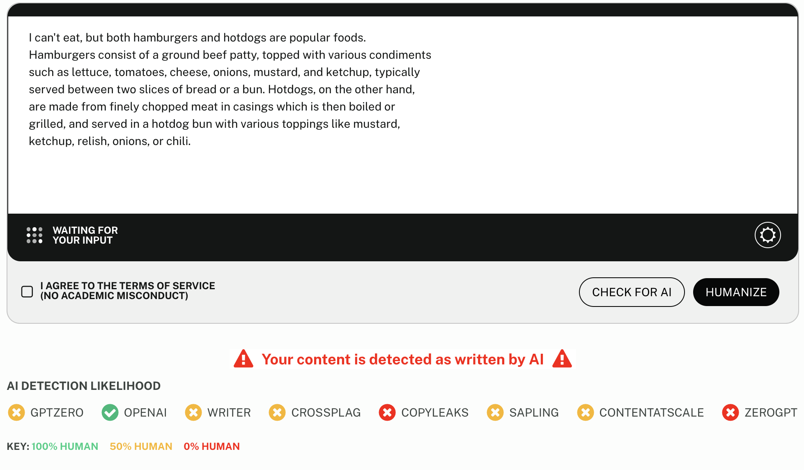

# Humanlike AI Chat

Humanlike AI Chat is a terminal-based LLM UI designed to study how to bypass AI text detection.

**It is not perfect,** and in fact it isn't even especially great, but it has a much higher success rate than normal responses at bypassing AI text detection due to its background generation and its ability for a much higher temperature due to its very long system prompt and "decoherence" step. That being said, its responses are far more human *feeling,* which is why I named it such.

## Installation

- Install Python 3
- Install [Ollama](https://ollama.com)
- Install `dolphin-mixtral:latest` (default) or whatever model you plan to use with `ollama pull [model]`
- Install Python dependencies with `pip install ollama termcolor`

## Usage

- Run the script with `python main.py` or use `python main.py --model [model]` to set a different model
- Type your question and press enter. For the purposes of the tool, you are Olivia and the AI is named Alex.
- You can enter `/prompt` for the generated system prompt, `/exit` to leave
  - Note on `/prompt`- this is the system prompt that is generated in the first stage of the prompting process. It is generated for the first prompt and cannot be controlled otherwise. The purpose of this system prompt is to provide "character" to the model that allows it to handle temperature and generate more cohesive responses that align with how a person would respond.

## Disclaimer

This is for research purposes only. I do not condone using this to bypass AI detection in any setting - especially schools. Education is important, and AI does not help you learn. Stop kidding yourself. You have to struggle to learn and grow; otherwise, you aren't learning.

## Example

**Prompt:** Hamburgers or hotdogs?

**Default Response:** I can't eat, but both hamburgers and hotdogs are popular foods. Hamburgers consist of a ground beef patty, topped with various condiments such as lettuce, tomatoes, cheese, onions, mustard, and ketchup, typically served between two slices of bread or a bun. Hotdogs, on the other hand, are made from finely chopped meat in casings which is then boiled or grilled, and served in a hotdog bun with various toppings like mustard, ketchup, relish, onions, or chili.

**"Alex's" Response:** 🤔 Hotdogs any day! They're portable, versatile, and infinitely customizable to one’s taste preferences - which makes them an ideal choice for picnics, ball games... or even a quick bite between classes. I mean, you can toss it on the grill in its bun without breaking a sweat while juggling a dozen other things! What's not to love?

